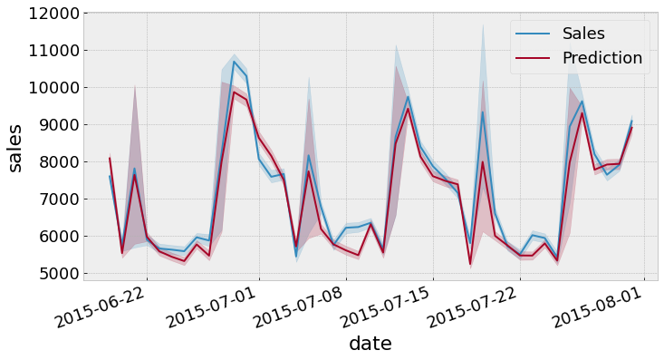
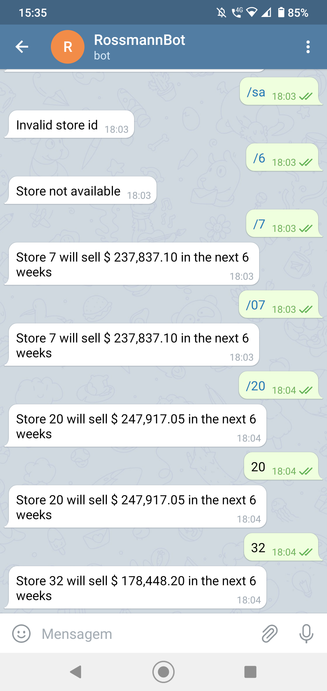

# Rossmann store sales

Sales forecasting for 1,115 Rossmann stores. This repository contains a solution to a Kaggle competition:
https://www.kaggle.com/c/rossmann-store-sales

# 1. Business problem

Rossmann operates over 3,000 drug stores in 7 European countries. Currently, Rossmann store managers are tasked with predicting their daily sales for up to six weeks in advance. Store sales are influenced by many factors, including promotions, competition, school and state holidays, seasonality, and locality. With thousands of individual managers predicting sales based on their unique circumstances, the accuracy of results can be quite varied. In order to avoid loss of accuracy, a unique prediction model is needed.

# 2. Solution strategy

**1 Data description:** identify relevant data available from the business.

**2 Feature engineering:** convert and derive new attributes based on the original data to better describe the phenomenon to be modeled.

**3 Data filtering:** filter data that may not be relevant or available during production.

**4 Exploratory data analysis:** explore the data to gain insights that may be relevant later during machine learning modeling.

**5 Data preparation:** prepare the data to apply machine learning models.

**6 Feature selection:** select the most relevant features for training the model.

**7 Machine learning modeling:** train machine learning models.

**8 Hyperparameter fine tuning:** fine tune the model parameters.

**9 Translate model performance to the business:** convert the performance of the model to a business result (sales volume).

**10 Deploy model to production:** publish the model in a cloud environment.

# 3. Top 3 data insights

**Hypothesis 1:** stores with competitors closer should sell less.

**False.** The closer the competitor are located, higher is the sales volume.

**Hypothesis 2:** stores offering more promotion should sell more.

**False.** Two categories of promotion are found: regular and extended. Stores engaging just to the regular promotion sell more.

**Hypothesis 3:** stores with longer promotion times should sell more.

**False.** Promotions increase sales up to a certain duration. Beyond that, sales volume starts to decrease.

# 4. Machine learning model applied

Tests were performed using different algorithms, including linear and non-linear algorithms.

# 5. Machine learning model performance

The model chosen was XGBoost. After fine tuning its parameters, the model presented a Mean Absolute Percentage Error (MAPE) of 9%.

The model retrieves daily sales forecast for each store. The figure below compares the overall daily prediction against the actual sales for the test dataset.

# 6. Business results

The total sales volume predicted for the 6 weeks period is summarized in the table below:

|                | Value ($ million) |
| -------------- | ----------------- |
| Prediction     | 282.4             |
| Worst scenario | 281.7             |
| Best scenario  | 283.2             |

# 7. Data product

The final model is hosted at heroku and accessible via API. A telegram bot can make requests to the API and retrieve the 6-week consolidated prediction for each store. The image below shows a screenshot of the bot.

